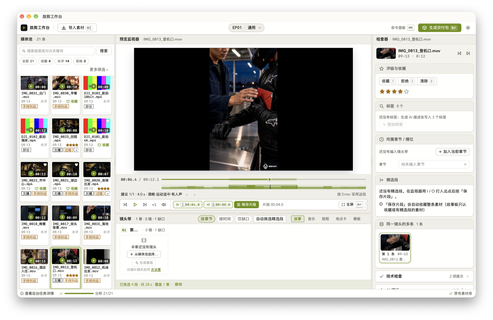
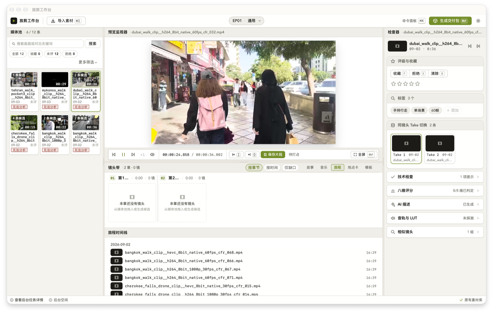

<p align="center">
  
</p>

<h1 align="center">旅剪工作台 · TripCut Studio</h1>

<p align="center"><strong>把一整天的旅途素材，收束成一条可以开始剪的故事。</strong></p>

<p align="center"><strong>v0.5.0：开包即用的旅拍精选工作台</strong> —— 导入 → 自动挑选精选段 → 快速导出，三步就能拿到一包能用的精选片段。</p>

<p align="center">
  <a href="https://github.com/qx04222/tripcut-studio/releases/tag/v0.5.0">下载 v0.5.0</a>
  · <a href="docs/USER_GUIDE.md">用户指南</a>
  · <a href="docs/releases/v0.5.0.md">版本说明</a>
  · <a href="docs/design/design-system.md">设计系统</a>
  · <a href="CONTRIBUTING.md">参与贡献</a>
</p>

<p align="center">
  
  
  
  
</p>

> [!IMPORTANT]
> v0.5.0 是面向测试者的 Apple Silicon 未签名预览版，使用 ad-hoc 签名，尚未经过 Apple Developer ID 签名与公证。请从本仓库 Release 下载、核对 SHA-256，并使用有独立备份的素材测试；首次启动如遇 Gatekeeper 拦截，右键点击应用图标选择「打开」即可。
>
> 本版 DMG：[`TripCut-Studio_0.5.0_github-preview-v0.5.0-20260913T2307Z_preview_aarch64.dmg`](https://github.com/qx04222/tripcut-studio/releases/download/v0.5.0/TripCut-Studio_0.5.0_github-preview-v0.5.0-20260913T2307Z_preview_aarch64.dmg)，SHA-256 `40914fdf76f06aea4eb63961a4a511f7f173b144893a8e2df8fba5a9896991cf`。
>
> **本版软件会自己挑精选段，导出也只剩一步**；已安装 v0.3.0 的用户可直接在「设置 → 关于 → 检查更新」应用内升级到本版（0.4.0 未对外发布，本版一并包含它的全部修复）。

## 它解决的不是剪辑，而是剪辑前的混乱

一次旅居或房车旅行，往往会留下相机卡、移动硬盘、手机和 NAS 中的大量零散片段。真正耗时间的，是重新看完素材、判断哪些镜头值得保留、找到故事主线，再把结果可靠地交给剪映。

TripCut Studio 是一个中文优先、Local-first 的 macOS 素材工作台。它不取代剪映，而是在剪映之前完成最费时间的整理工作：

- 引用式导入素材，原片保持只读；
- 自动分析每条素材最好看的一段，一键挑出整集的精选段，挑错可撤销；
- 播放、评级、收藏、拒绝和手动标记精选段；
- 用 Episode、Chapter、Beat 与 Storyboard 组织故事；
- 快速导出精选片段，或生成可核对、可恢复、可继续剪辑的完整交付包。

## 一条从原片到剪映的工作流

<p align="center">
  
</p>

| 阶段 | 工作台帮你完成 | 创作者保留的决定权 |
| --- | --- | --- |
| 导入 | 索引相机卡、移动硬盘、本地目录与 watched folder | 原片位置与备份策略 |
| 挑选 | 每条素材的建议精选段、一键自动挑选整集、4K HEVC/10-bit 播放、收藏、评级、I/O 选段 | 哪些镜头值得进入故事，建议采不采纳 |
| 叙事 | Episode、章节、Beat、Storyboard 与跨集素材记忆 | 故事主线、事实与最终顺序 |
| 导出 | 快速导出精选片段；或完整交付包：1080p 参考粗剪、CSV、字幕与中文说明 | 在剪映中完成节奏、声音与成片 |

## 为旅居和房车 Vlog 设计

| 旅途中的真实问题 | TripCut 的处理方式 |
| --- | --- |
| 素材散落在多个盘和目录 | watched folder 与引用式索引，不强迫搬运原片 |
| 一天拍几十条，没时间从头看到尾 | 每条素材自动标出最精彩的一段，选中就从那里开播，一键挑出整集精选 |
| 驾驶、驻车、做饭、风景混在一起 | 快速筛片、质量角标、精选段与 Shot Stack |
| 每一集都容易重复相似镜头 | Episode 封存与跨集素材记忆 |
| 在路上网络不稳定 | 核心整理、播放与交付均以本地工作流为主 |
| AI 建议可能不可靠 | 建议与人工确认分开保存，自动挑选可整批撤销，创作者拥有最终裁量 |
| 最终仍要在熟悉的软件里精剪 | 快速导出精选片段，或生成稳定交付包进入剪映专业版 |

## v0.5.0 包含什么

### 开包即用：导入 → 自动挑选 → 快速导出

<p align="center">
  
</p>

0.3.0 发出去之后，我们请业主真实走了一遍全流程，0.4.0（未对外发布）修掉了 37 处卡点；这一版在那个基础上回答三个问题：软件能不能帮忙挑精选段、导出能不能更简单、播放器能不能更聪明。

- **时刻分热力条**：每条素材都会离线分析"哪一段最好看"（清晰度、运动幅度、曝光、有没有声音），选中后监视器进度条下方多出一条热力条，标出建议片段的位置与分数；
- **`Enter` 采用建议**：一下就把当前建议采纳成精选段，`N` / `⇧N` 在多条建议之间切换；
- **一键自动挑选，可撤销**：镜头带工具条新增「自动挑选精选段」，选范围（收藏 / 评分较高 / 全部）和大致时长，按章节均匀挑出好片段；不满意整批「撤销」，手动挑的片段不受影响；
- **从最精彩处开播**：选中素材默认从它最出彩的那一刻开始播放，不再永远从头看起（设置里可关）；
- **快速导出记住文件夹**：交付面板默认变成「快速导出」——只导出挑好的精选段与收藏素材，导到上次用过的文件夹，完成后直接在访达里打开；检查器与素材列表新增「导出所选…」；完整交付包退到次选位置，功能不变；
- **播放器**：逐帧前进 / 后退，`⌥←` / `⌥→` ±5 秒，打好入出点后 `⇧L` 循环反复看，播完自动接下一条（可关），静音状态跨素材记住，素材卡片上悬停鼠标就能看到动态预览；
- **设置三分区**：九个分类收进「常用 / 工具与模型 / 关于」，常用项摆在最前，不常用的收进「高级…」；
- **首启三步引导**：第一次打开不再是工具链检查清单，而是「导入素材 → 挑选片段 → 导出」三张引导卡片；
- **界面去术语**：内部代码名和技术缩写换成看得懂的说法，每个界面只保留一个最显眼的主要操作，错误与空白状态用一句话说清"发生了什么、接下来怎么办"。

### 键位

监视器里新增的单键（焦点在监视器栏时生效，`F6` 可把焦点送过去）：

| 键位 | 作用 |
| --- | --- |
| `Enter` | 采纳当前建议段为精选段 |
| `N` / `⇧N` | 下一条 / 上一条建议段 |
| `,` / `.` | 逐帧后退 / 前进 |
| `←` / `→` | ±1 秒；`⌥←` / `⌥→` ±5 秒 |
| `I` / `O` / `S` | 打入点 / 出点 / 保存精选段 |
| `⇧L` | 在入出点区间内循环播放 |
| `J` / `K` / `L` | 回退一秒并暂停 / 暂停 / 播放 |
| `Space` | 播放 / 暂停（真机上偶发失灵，可用 `K` 替代） |

沿用的全局键位：

| 键位 | 作用 |
| --- | --- |
| `F6` / `⇧F6` | 在媒体池 → 预览 → 镜头带 → 检查器之间轮转焦点 |
| `⌘1` / `⌘2` | 折叠 / 展开媒体池、检查器 |
| `⌘I` | 打开导入素材抽屉 |
| `⌘⏎` | 沉浸预览（全屏监视器） |
| `⌘,` | 设置 sheet |
| `⌘K` | 命令面板 |
| `F` / `X` / `1–5` / `0` | 收藏 / 拒绝 / 星级 / 清除评级 |
| `?` | 帮助与键位表 |

界面令牌、组件套件与密度规则见 [设计系统](docs/design/design-system.md)。

### 已知限制

- 剪映 11.4 草稿导出已生成，但尚未在真机上人工验证，导入前请先备份剪映草稿目录；
- Chinese-CLIP 画面语义检索与 Whisper 语音转写是可选增强，不随安装包分发，可在「设置 → 工具与模型」里下载安装；没装时"有没有说话"只按音量粗判，响亮环境声也可能被当成人声；
- MiniMax「生成候选」补镜需自备 API key（设置 → 工具与模型 → 云端补镜，默认关闭，Key 只写入 macOS 钥匙串）；
- 2 倍 / 4 倍速与反向播放目前靠快速跳位模拟，画面有轻微跳动感；音量高低还不记忆（静音会记）；
- 暗场 / 夜景素材的建议分数整体偏保守，相对排序仍然有效；
- 完整交付包的选项里还留有少量偏技术性的说明文字，快速导出已全部是大白话。

完整变更详见 [v0.5.0 更新说明](docs/releases/v0.5.0.md)；0.4.0 修掉的 37 处走查问题见 [v0.4.0 更新说明](docs/releases/v0.4.0.md)。

<details>
<summary>v0.3.0 包含什么（上一版）</summary>

### v0.3.0

#### 界面重做：单屏导演台

<p align="center">
  
</p>

原来的「左侧四步导航 + 四个页面」没有了，改成一屏三栏：

- **媒体池**（左）找素材：搜索、筛选 chips、2–4 列缩略图网格，500 条素材走行级虚拟化 + 2 行 overscan；
- **预览监视器**（中上）看画面：复用同一个 mpv 实例，不再为每条素材销毁重建；播放 / ±1 秒 / 速度 / 音量 / 时间码 / `I`·`O` 打点与保存片段 / `⌘⏎` 沉浸；
- **镜头带**（中下）排顺序：按章节分组、拖动改序（跨章节拖即改归属）、空槽位点「生成候选」；下面那排分段 〈故事 · 音乐 · 旅程 · 地点卡 · 模板〉决定中下区展开什么；
- **检查器**（右）改这一条：评级 / 标签 / 章节归属 / Take / AI 描述常驻，技术检查、八维、音轨与 LUT、相似镜头是折叠段，逐段记忆；
- **后台状态条**（底）：分析 / 转写 / 云端生成 / 缺失素材计数，点它落到导入抽屉的任务分页。

顶栏是两只抽屉加一张 sheet：**导入素材**（`⌘I`）与**生成交付包**从两侧滑出，**设置**（`⌘,`）从下方升起；三者都有可见的「关闭」按钮、可点的遮罩，`Esc` 一次只退一层，关掉后焦点回到触发它的按钮。窗口窄于 1280 自动折检查器、窄于 1040 连媒体池一起折，中栏永不折。

新的全局键位：

| 键位 | 作用 |
| --- | --- |
| `F6` / `⇧F6` | 在媒体池 → 预览 → 镜头带 → 检查器之间轮转焦点 |
| `⌘1` / `⌘2` | 折叠 / 展开媒体池、检查器 |
| `⌘I` | 打开导入素材抽屉 |
| `⌘⏎` | 沉浸预览（全屏监视器） |
| `⌘,` | 设置 sheet |
| `⌘K` | 命令面板 |
| `?` | 帮助与键位表 |

界面令牌、组件套件与密度规则见 [设计系统](docs/design/design-system.md)。

#### 旧界面与旧链接

旧的四页界面在这一版里完整保留，可从「设置 → 外观 → 界面 →「切回旧界面」」热切换回去，不用重启；**下一版移除**（截至 0.5.0 仍保留，将在后续版本移除）。旧的 `#/import`、`#/deliver`、`#/settings`、`#/review` 链接会自动转接到对应的抽屉 / sheet / 工作区。两套界面同时打包，这一版包体因此偏大。

#### 已知限制

- 剪映 11.4 草稿导出已生成，但尚未在真机上人工验证，导入前请先备份剪映草稿目录；
- MiniMax「生成候选」补镜需自备 API key（设置 → 云端补镜，默认关闭，Key 只写入 macOS 钥匙串），不随安装包分发；
- 启动恢复页仍是旧风格，镜头带附属区（音乐 / 旅程 / 地点卡 / 模板）默认高度偏矮，可拖动分隔条调整；
- 1280×800 是最小可用尺寸而非舒适尺寸，三栏在该宽度下都接近各自最小值。

完整变更详见 [v0.3.0 更新说明](docs/releases/v0.3.0.md)。

更早的 v0.2.0 变更见 [v0.2.0 更新说明](docs/releases/v0.2.0.md)。

</details>

## 自动更新

设置页「关于 → 检查更新」可发现新版本并下载安装，安装包会做 minisign 签名校验；已安装 0.3.0 的用户可直接应用内更新到 0.5.0；未签名的预览版仍可能被 Gatekeeper 拦截，请按提示核对来源后放行。

## 下载与第一次使用

1. 前往 [v0.5.0 Release](https://github.com/qx04222/tripcut-studio/releases/tag/v0.5.0)，下载 [`TripCut-Studio_0.5.0_github-preview-v0.5.0-20260913T2307Z_preview_aarch64.dmg`](https://github.com/qx04222/tripcut-studio/releases/download/v0.5.0/TripCut-Studio_0.5.0_github-preview-v0.5.0-20260913T2307Z_preview_aarch64.dmg)；
2. 同时下载 `SHA256SUMS.txt`，核对 DMG 的 SHA-256 为 `40914fdf76f06aea4eb63961a4a511f7f173b144893a8e2df8fba5a9896991cf`；
3. 打开 DMG，把“旅剪工作台”拖入 Applications；
4. 本版为 ad-hoc 签名、未公证：首次启动 Gatekeeper 会拦截，右键点击应用图标选择「打开」（或在“系统设置 → 隐私与安全性”中确认“仍要打开”）；
5. 第一次打开会看到「导入素材 → 挑选片段 → 导出」三步引导，按[用户指南](docs/USER_GUIDE.md)用一份有备份的短素材走完第一次“导入 → 自动挑选 → 快速导出”。

完整安全边界见[未签名预览版说明](docs/UNSIGNED_PREVIEW.md)。不要关闭 Gatekeeper，也不要运行来源不明的解除隔离命令。

## 产品边界

| TripCut 会做 | TripCut 不会做 |
| --- | --- |
| 整理、筛选、组织和交付拍摄素材 | 取代完整非线性剪辑器 |
| 在本机保存索引、项目与确认结果 | 静默上传用户视频 |
| 为重复镜头、故事结构和交付提供辅助 | 替创作者决定事实与最终叙事 |
| 把稳定文件带入剪映继续工作 | 声称获得剪映官方兼容认证 |

剪映及相关商标归其权利人所有。本项目与剪映不存在官方隶属或认证关系。

## 从源码开发

开发环境需要 macOS Apple Silicon、Node.js 22+、Rust stable 与 Tauri 2 所需系统工具。

```sh
npm ci
npm run typecheck
npm run lint
npm test
cargo test --manifest-path src-tauri/Cargo.toml
```

原生媒体组件与 DMG 构建顺序：

```sh
./scripts/build-lgpl-ffmpeg.sh
./scripts/build-libplacebo.sh
./scripts/build-lgpl-mpv.sh
./scripts/build-whisper.sh

TRIPCUT_PACKAGE_MODE=preview \
TRIPCUT_ALLOW_ADHOC=1 \
TRIPCUT_BUILD_STAMP=local-preview \
./scripts/package-dmg.sh
```

完整构建、签名、许可证与发布门禁见[发布说明](docs/RELEASE.md)。打包后的应用不依赖用户安装 Homebrew。

## 隐私、安全与贡献

- 素材索引和项目数据默认保存在本机；
- 应用不会静默上传视频；
- L3 provider 通过标准输入接收请求，避免把内容写入命令行参数；
- 安全问题请按 [SECURITY.md](SECURITY.md) 使用 GitHub Private Vulnerability Reporting 私下提交；
- 功能反馈和可复现问题欢迎提交到 [Issues](https://github.com/qx04222/tripcut-studio/issues)；
- 代码、文档与测试贡献方式见 [CONTRIBUTING.md](CONTRIBUTING.md)。

## 许可证

TripCut Studio 源代码采用 [Apache License 2.0](LICENSE)。打包的 FFmpeg、mpv、libplacebo、whisper.cpp 及其他依赖继续适用各自许可证；详情见[第三方声明](docs/THIRD_PARTY_NOTICES.txt)。

---

<p align="center"><strong>旅途负责发生，TripCut 负责把它整理成故事。</strong></p>
